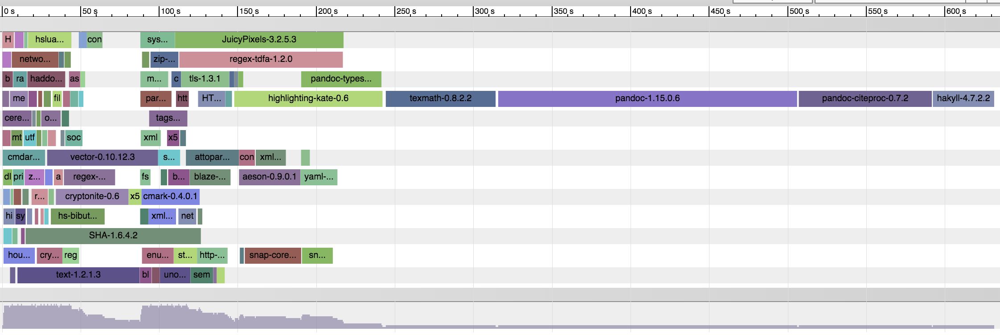
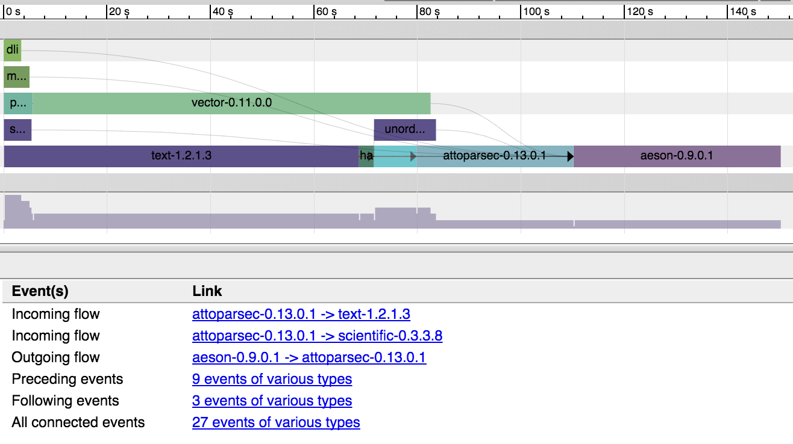

# cabal-install-trace
*Render a log of cabal install as a graph.*

`cabal install hakyll`, rendered without dependency arrows.


`cabal install aeson`, rendered with dependency arrows, and the `attoparsec` slice selected. Dependencies and dependees are listed.


## Prerequisites

### 1. Build log
You'll need a build log from `cabal install`, annotated with the timestamps of each line.

```bash
 $ cabal install hakyll -j | ./timestamp.sh | tee cabal-install-log.txt
2124420: Resolving dependencies...
3920216: Notice: installing into a sandbox located at
3924960: /Users/kolmodin/code/project/.cabal-sandbox
3957085: Configuring base64-bytestring-1.0.0.1...
3974202: Configuring SHA-1.6.4.2...
3978922: Configuring byteable-0.1.1...
3990231: Configuring cereal-0.4.1.1...
3996726: Configuring data-default-class-0.0.1...
4003335: Configuring deepseq-generics-0.1.1.2...
4020057: Configuring digest-0.0.1.2...
4084691: Configuring dlist-0.7.1.1...
5502098: Building SHA-1.6.4.2...
5507219: Building deepseq-generics-0.1.1.2...
5512694: Building byteable-0.1.1...
...
```

`timestamp.sh` is a simple tool to prepend each line with the time since the script started. It's provided in this repository.

### 2. Optional: a ghc-pkg dot file

The tool can also illustrate dependencies if you provide the output of `ghc-pkg dot`. In my case, I installed into a sandbox, so I provide the sandbox' pkg db path.

```bash
 $ ghc-pkg dot --package-db=.cabal-sandbox/x86_64-osx-ghc-7.10.2-packages.conf.d/ \
     | tee ghc-pkg-dot-log.txt
digraph {
...
```

### 3. Download Catapult

Catapult creates the view of cabal-install-trace's json files. Get it from github.

```bash
git clone https://github.com/catapult-project/catapult
```

## Using cabal-install-trace

Invoke the tool with the files you've prepared. Accepted parameters:

`cabal-install-trace [<cabal install build log> [<ghc-pkg dot file>] ]`

```bash
 $ cabal-install-trace cabal-install-log.txt ghc-pkg-dot-log.txt > log.json
 $ ../catapult/tracing/trace2html log.json
log.html
 $ open log.html # or open with your favourite browser
```

To see the package dependency arrows, enable `Flow events` under the `View Options` menu.
